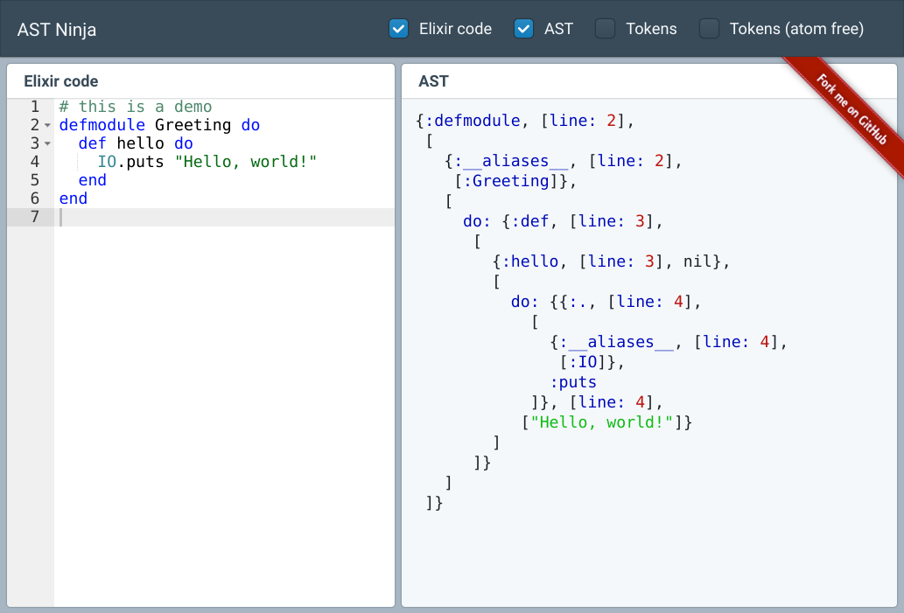

# Interactive Elixir AST explorer

Type some Elixir(ish) code, have it parsed by the Elixir parsed, and
inspect the output in real time. Like
[Code.string_to_quoted/2](https://hexdocs.pm/elixir/Code.html#string_to_quoted/2),
but in a browser.

Demo: https://ast-ninja.apps.botsqd.com/

